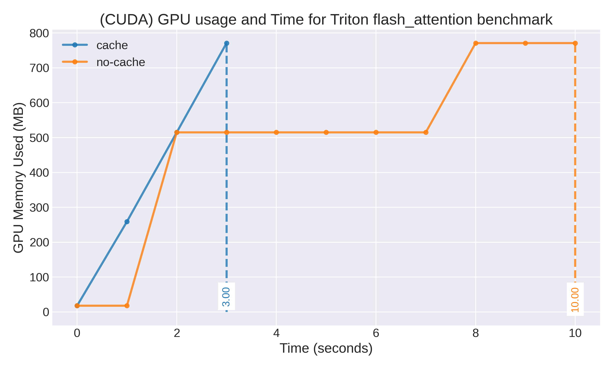
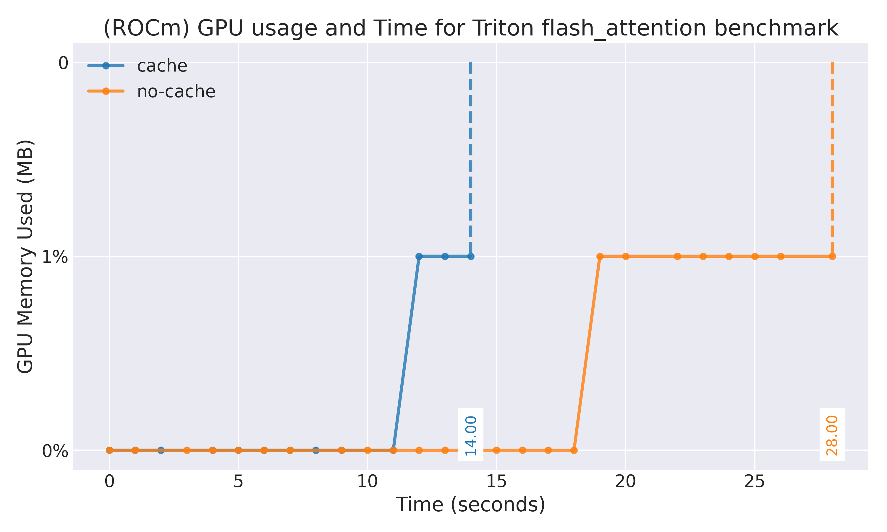

# Triton Cache Performance Comparison

  
*CUDA: Triton cache significantly improves startup performance*

  
*ROCm: Triton cache significantly improves startup performance*

## Proof of Concept

This benchmark compares GPU memory usage and startup performance of Triton kernels in two scenarios:

1. **With Triton cache pre-loaded** - Cache exists from previous run
2. **Without Triton cache** - Clean cache state

Key findings:
- Triton cache significantly reduces startup time
- More consistent memory usage patterns with cached kernels
- Improved resource utilization during initial model loading

## Prerequisites

### Hardware Requirements
- NVIDIA GPU (CUDA) or AMD GPU (ROCm)

## Usage

### Basic Benchmark
```bash
./benchmark.sh --arch [cuda|rocm]
```

### Advanced Options
```bash
# Custom cache location and script
./benchmark.sh \
  --arch cuda \
  --triton-cache-dir ~/alternate_cache \
  --script ./custom_script.py
```

### Expected Output
1. `gpu_usage_log.csv` - Time-series memory data
2. `gpu_memory_usage_comparison.png` - Visualization plot

## Technical Details

### Benchmark Process
1. **Cold Start** (no cache):
   - Purge existing Triton cache
   - Run script
   - Log GPU memory at 1Hz frequency

2. **Warm Start** (with cache):
   - Reuse generated kernels
   - Run identical script
   - Compare memory/time metrics

### Key Configuration
```bash
export TRITON_CACHE_DIR="~/.triton/cache"  # Default cache location
```

## License
Apache 2.0 [LICENSE](LICENSE)
